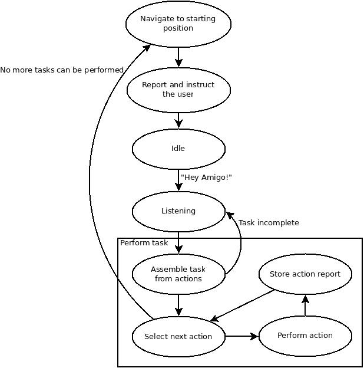

Responsible: Rokus

# Start-up

    <robot>-challenge-gpsr

# Scenario

 - The robot starts at the entrance of the arena with the door closed.
 - The robot will drive to the meeting point and say "Trigger me by saying my name."
 - Say "Amigo".
 - The robot will say "What can I do for you?" and ping for input.
 - Say your (auto generated) command after the ping.
 - After each command, the robot returns to the operator and reports.
 - After three successfully executed commands, the robot will return to the operator, report, and exit the arena.

# Testing
The category chosen for the 2018 GPSR is category 1.
Category 2 may be tested as well, because the tasks are very similar.
However, they seem to be slightly more difficult to execute.

## Generating random command
Use the command generator:

    cmdgen-gpsr
    
When asked "File x already exists. Overwrite?" you can choose "Yes".

Press "1" to choose category 1

When Amigo asks for a command, read the generated command out loud from the screen.

In simulation, use:

    amigo-hear <command>
    
where <command> is the command from the generator, converted to lowercase and stripped from all punctuation marks like {,.!?}

The generator should be automatically installed, otherwise install manually:

    tue-get install cmdgen

# State machine design

The state machine builds upon the action server to perform the given tasks. Actions are assembled into a task. These actions require input, but may also provide input for next actions. If required input is needed before the first action can be performed, the task is not feasible, so the robot will have to ask for the missing information.

The task is performed (if possible) and the outcome is stored in a log.

The robot goes back to the starting position, where it should meet the operator again (maybe it should look for the operator?).

Finally, the task log is reported to the user just before the robot returns back to idle state.

