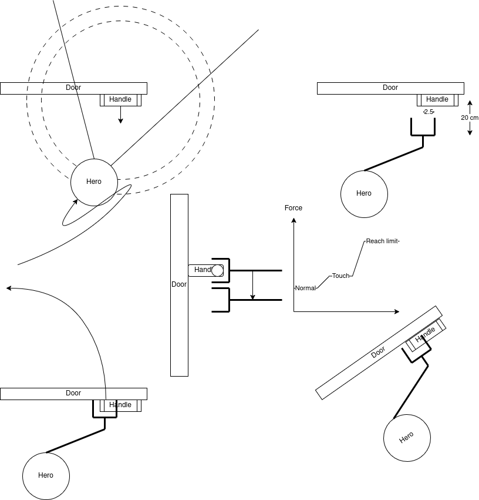

# robot_smach_states

Robot_smach_states is a library of, indeed, smach states and state machine, built using the SMACH state machine library from ROS.

There are states concerning navigation, perception, world modeling/reasoning, complex and simple arm movements, speech recognition, and some more.
Each state is passed an instance of the Robot-class from the tue-robotics/robot_skills-package.
The actions called via the robot_smach_states are implemented and executed via such a Robot-object. 

## Open door

Door opening is a complex chain of actions:
- Navigate to front of the door where it can observe the handle clearly. The distance now is 1.1 meter around the handle.
- Update the handle position: Using object detecion model already developed in image_detection_door_handle package. Need to launch ***roslaunch image_detection_door_handle door_handle_detection.launch*** beforehand. Then the action ***/hero/handle_locator/locate_handle*** would be available to call.
- Move the gripper to front of the handle, before the graps point 20 cm. This grasp point locates on the handle with offset 2.5 cm from center.
- Move the gripper to grasp point and close the gripper. 
- Unlatch the handle by moving down the arm downward until the force sensor senses the second steepy change (There are 2 steps, the first one is when the gripper actually touch the handle and the second one is when the gripper completely unlock the door).
- Pull/ Push the door, create a circle orbit base on the handle position and direction, then sample into multiple waypoints, with 0.4 rad resolution. Then move the arm via these waypoints

